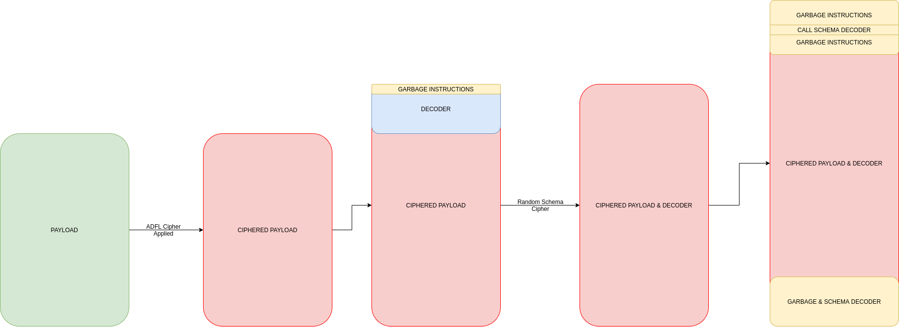

<div align="center">
  
  <br>

  [![GitHub All Releases][release-img]][release]
  [![Build][workflow-img]][workflow]
  [![Issues][issues-img]][issues]
  [![Crates][crates-img]][crates]
  [![License: MIT][license-img]][license]
</div>

[crates]: https://crates.io/crates/sgn
[crates-img]: https://img.shields.io/crates/v/sgn
[release]: https://github.com/moloch--/sgn/releases
[release-img]: https://img.shields.io/github/v/release/moloch--/sgn
[issues]: https://github.com/moloch--/sgn/issues
[issues-img]: https://img.shields.io/github/issues/moloch--/sgn?color=red
[license]: https://raw.githubusercontent.com/moloch--/sgn/master/LICENSE
[license-img]: https://img.shields.io/github/license/moloch--/sgn.svg
[workflow-img]: https://github.com/moloch--/sgn/actions/workflows/build.yml/badge.svg
[workflow]: https://github.com/moloch--/sgn/actions/workflows/build.yml
[fe-article]: https://www.fireeye.com/blog/threat-research/2019/10/shikata-ga-nai-encoder-still-going-strong.html
[lfsr]: https://en.wikipedia.org/wiki/Linear-feedback_shift-register

SGN is a polymorphic binary encoder for x86 and x64 shellcode. It uses an
additive feedback loop to encode a payload and produces a self-decoding,
polymorphic result inspired by the original
[Shikata ga nai](https://github.com/rapid7/metasploit-framework/blob/master/modules/encoders/x86/shikata_ga_nai.rb).

This fork preserves the Go module, CLI, and public `pkg` API while adopting the
upstream Rust port as the encoding implementation. The Rust core uses
[`iced-x86`](https://docs.rs/iced-x86) instead of the legacy Keystone text
assembler.

## Go/Wasm architecture

The checked-in [`pkg/sgn.wasm`](pkg/sgn.wasm) is the Rust library compiled as a
`wasm32-wasip1` `cdylib`. Go embeds that module with `go:embed` and executes it
in-process with wazero:

```text
Go CLI or github.com/moloch--/sgn/pkg
                    |
                    v
              wazero runtime
                    |
                    v
       embedded pkg/sgn.wasm ABI
                    |
                    v
          upstream Rust Encoder
```

Go users therefore do not need Rust installed at runtime and do not launch an
external process. Rust remains available as a native library and CLI from the
same checkout.

The existing Go `Encoder`, its exported fields, and helpers are retained for
source compatibility. `Encoder.Encode` now delegates to the Rust/Wasm pipeline.
Legacy helpers such as the assembly, cipher, decoder, and obfuscation helpers
remain implemented in Go for callers that use them directly; they are not part
of the native-Rust/Wasm byte-parity guarantee.

## Determinism, parity, and randomness

`Encoder.EncodeWithSeed` accepts a 32-byte `RandomSeed` and is deterministic
when the payload and all `Encoder` fields are also identical. In particular,
the legacy one-byte `Encoder.Seed` is the ADFL key and must be fixed separately.
The compatibility suite supplies the same inputs to native Rust and embedded
Rust/Wasm, then compares their output bytes and final mutable encoder state.

The parity boundary is native Rust versus the embedded build of that same Rust
source and locked dependency graph. It intentionally does not promise the same
bytes as the historical Go encoder: the move from Keystone to `iced-x86`, plus
changes to instruction layout and random-number consumption, changed the
polymorphic byte stream.

Production calls should use `Encode`. The Go API obtains both its ADFL key and
its 32-byte Rust RNG seed from `crypto/rand`; native Rust `Encoder::encode` uses
the cryptographically secure thread RNG. Fixed seeds are exposed for tests,
reproducible fixtures, and debugging, not as the production default.

## Features

- 32-bit and 64-bit payload support.
- Small, loop-free ADFL decoder stub.
- Optional schema encoding so the decoder also appears polymorphic.
- Random value-preserving garbage instructions.
- Optional safe mode that preserves register values.
- Multiple recursive encoding passes.
- ASCII and bad-character filtering in the Go CLI.

## How it works

Each encoding pass:

1. Optionally appends a register-restore suffix for safe mode.
2. Prepends random, value-preserving garbage instructions.
3. Ciphers the payload with the ADFL cipher and prepends its decoder stub.
4. Unless `--plain` is set, schema-encrypts the stub and prepends a schema
   decoder.
5. Optionally repeats the pipeline for additional encoding passes.
6. Optionally prepends the register-save prefix for safe mode.

<p align="center">
  
</p>

## Install and build

Install the self-contained Go/Wasm CLI:

```sh
go install github.com/moloch--/sgn@latest
```

Build it from a checkout using the pinned Rust toolchain:

```sh
rustup toolchain install 1.94.0
rustup target add wasm32-wasip1 --toolchain 1.94.0
make
./build/sgn --help
```

Install the native Rust CLI from the checkout instead:

```sh
cargo +1.94.0 install --locked --path .
```

## Go API

`Encode` uses fresh cryptographic randomness on every call:

```go
package main

import (
    "log"
    "os"

    sgn "github.com/moloch--/sgn/pkg"
)

func main() {
    payload, err := os.ReadFile("payload.bin")
    if err != nil {
        log.Fatal(err)
    }

    encoder, err := sgn.NewEncoder(64)
    if err != nil {
        log.Fatal(err)
    }
    encoded, err := encoder.Encode(payload)
    if err != nil {
        log.Fatal(err)
    }
    if err := os.WriteFile("payload.bin.sgn", encoded, 0o600); err != nil {
        log.Fatal(err)
    }
}
```

Use `EncodeWithSeed` when a reproducible fixture is required:

```go
func encodeFixture(payload []byte) ([]byte, error) {
    encoder, err := sgn.NewEncoder(64)
    if err != nil {
        return nil, err
    }
    encoder.Seed = 0xa7 // the independent, legacy one-byte ADFL key

    var randomSeed sgn.RandomSeed
    for i := range randomSeed {
        randomSeed[i] = 0x42
    }
    return encoder.EncodeWithSeed(payload, randomSeed)
}
```

## Native Rust API

```rust
use sgn::{Encoder, RANDOM_SEED_SIZE};

fn main() -> Result<(), Box<dyn std::error::Error>> {
    let payload = std::fs::read("payload.bin")?;

    // Production: cryptographically secure randomness.
    let mut production = Encoder::new(64)?;
    let _encoded = production.encode(&payload)?;

    // Tests/fixtures: fix both the ADFL key and the 32-byte RNG seed.
    let mut replay = Encoder::new(64)?;
    replay.seed = 0xa7;
    let _replayed = replay.encode_with_seed(&payload, [0x42; RANDOM_SEED_SIZE])?;
    Ok(())
}
```

See [`examples/encode_binary.rs`](examples/encode_binary.rs) for a complete
native example.

## CLI

The Go/Wasm CLI retains the fork's existing flags:

```text
Usage: sgn

Flags:
  -i, --input=STRING       Input binary path
  -o, --out=STRING         Encoded output binary name
  -a, --arch=64            Binary architecture (32/64)
  -c, --enc=1              Number of encoding passes
  -M, --max=50             Maximum decoder-obfuscation bytes
      --plain              Do not encode the decoder stub
      --ascii              Require fully ASCII-printable output
  -S, --safe               Preserve register values
      --badchars=STRING    Avoid bytes such as \\x00\\x0a
  -v, --verbose            Verbose output
      --version            Print version
```

Example:

```sh
sgn -i shellcode.bin -o encoded.bin -a 64 --badchars '\x00\x0a\x0d'
```

## Updating the embedded Wasm

Rust source changes must be accompanied by a refreshed embedded module. All
Cargo commands use `--locked`, and the Makefile uses Rust 1.94.0 so the tracked
artifact can be reproduced in CI. The Wasm build also remaps the checkout and
Cargo-home source paths to stable prefixes, keeping local paths out of the
binary and making the byte comparison portable across builders.

```sh
# Build target/wasm32-wasip1/release/sgn.wasm and copy it into pkg/sgn.wasm.
make wasm-update

# Independently rebuild and fail if the tracked copy differs.
make wasm-verify

# Verify the embedded module, then build the Go CLI.
make
```

`Cargo.lock` and `pkg/sgn.wasm` are intentionally committed. `target/` and
`build/` remain generated output.

## Testing

Run the complete native Rust, Go, and seeded differential suite:

```sh
make test
```

The individual commands are:

```sh
make test-rust
make test-go
make test-compat
```

`make test-compat` builds `examples/compat_oracle.rs`, sets
`SGN_NATIVE_ORACLE`, and runs `TestNativeRustWASMCompatibility`. CI also runs
an upstream `d914ab2` golden vector so the native and Wasm implementations
cannot drift together unnoticed. The full Go suite runs with the race detector:

```sh
make test-go GO_TEST_FLAGS=-race
```

Native Rust tests include cipher round trips and real execution tests. The x86
execution harness skips automatically when a 32-bit C toolchain is unavailable
for local development. CI installs that toolchain and sets
`SGN_REQUIRE_EXECUTION=1`, so either x86 or x64 execution being unavailable is a
test failure rather than a silent skip.

## Notes on the Rust port

- Decoder stubs use `iced-x86`'s typed assembler API rather than Keystone
  assembly text.
- x64 uses RIP-relative addressing and x86 uses a `call`/`pop` two-pass scheme.
- The schema cipher operates directly on the CPU's native little-endian DWORD
  view.
- `random_byte` spans the full `0..=255` range and the garbage-size limit is
  consistently applied per block.

The original SGN design and Rust port are by Ege Balci. This fork's Go/Wasm
layer exists to keep the established Go integration while sharing the current
Rust encoder implementation.
